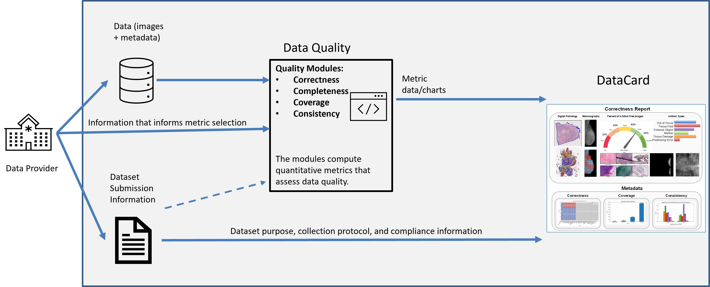

# DataCard
Autonomous Evaluation of WSI and Radiology Image Quality
A suite of software tools for comprehensive dataset evaluation and summarization with respect to correctness, completeness, coverage, and consistency

## Overview

DataCard examines submitted images for artifacts and provides a scorecard with descriptive and quantitative measures of dataset quality including image quality, metadata, and annotation quality for both mammography and histopathology whole slide images.

<p align="center">
  
</p>


## DataCard Generation

An outline of the DataCard pipeline is given below. Patient data from the provider, along with metadata and dataset information, is processed by data quality modules across several dimensions to produce the various output components of the DataCard including visualizations and reports. 

<p align="center">
  
</p>


## DataCard Dimensions

DataCard is based on 4C dimensions described below:


There are 4 main dimensions in the DataCard
1.	Correctness: Correctness refers to the accuracy of the recorded data, including the medical images, the disease labels, and patient metadata.​
2.	Completeness: Completeness refers to the proportion of samples that contains all associated data and metadata values.
3.	Coverage: Coverage refers to the amount and variety of data along different factors of variation.
4.	Consistency: Consistency refers to the uniformity of data quality across different subgroups and collection sites.

Individual tools developed to assess patient datasets across different dimensions and produce the various components of the DataCard are outlined below:

---
### Correctness Assessment

#### Digital Pathology

[**`HistoART`**](https://github.com/DIDSR/HistoART) is a Python-based toolkit designed for researchers and professionals working with digital pathology images. Its primary goal is to facilitate effective detection, classification, and quantification of artifacts in a histopathological slide dataset through both deep learning and hand-crafted feature approaches. This toolkit is particularly aimed at pathologists, data scientists, and students looking to streamline and enhance their analysis workflows.

Repository link: [HistoART](https://github.com/DIDSR/HistoART)


#### Digital Mammography

[**`Correctness DM`**](https://github.com/DIDSR/Correctness_DM) is an in-development Python-based toolkit designed to automatically identify common image quality issues and artifacts in Digital Mammography images. This code will be available once development is completed. 

Repository link: [Correctness DM](https://github.com/DIDSR/Correctness_DM)

---

### Completeness, Coverage, and Consistency Assessment

[**`DataCard-Metadata`**](https://github.com/DIDSR/DataCard-Metadata/) is a comprehensive tool for assessing the **Completeness**, **Coverage**, and **Consistency** of the metadata in patient datasets. The tool produces metadata features from patient metadata information as well as visualizations of available and missing data fields and distributions of values within individual fields.

Repository link: [DataCard-Metadata](https://github.com/DIDSR/DataCard-Metadata/)

An outline of the metadata assessment pipeline is given below.


---

## How to Cite

If you utilize DataCard in your research or applications, please cite the repository:

```bibtex
@misc{DataCard2025,
  author = {Seyed M. Kahaki, Alexander R. Webber, Tahsin Rahman},
  title = {DataCard},
  year = {2025},
  publisher = {GitHub},
  journal = {GitHub Repository},
  howpublished = {\url{https://github.com/DIDSR/DataCard}},
}
```

---

## Files and Data

All code and data files required for this project, along with instructions to acquire any necessary external data, are provided within the repositories for the different dimensions described above.

## Contact and Contributions

Seyed Kahaki: [seyed.kahaki@fda.hhs.gov](seyed.kahaki@fda.hhs.gov)

Alexander Webber: [alexander.webber@fda.hhs.gov](alexander.webber@fda.hhs.gov)

Tahsin Rahman: [tahsin.rahman@fda.hhs.gov](tahsin.rahman@fda.hhs.gov)

## Acknowledgements

This project was supported in part by an appointment to the ORISE Research Participation Program at the Center for Devices and Radiological Health, U.S. Food and Drug Administration, administered by the Oak Ridge Institute for Science and Education through an interagency agreement between the U.S. Department of Energy and FDA/CDRH.

## Disclaimer

This software and documentation (the "Software") were developed at the **US Food and Drug Administration** (FDA) by employees of the Federal Government in the course of their official duties. Pursuant to Title 17, Section 105 of the United States Code, this work is not subject to copyright protection and is in the public domain. Permission is hereby granted, free of charge, to any person obtaining a copy of the Software, to deal in the Software without restriction, including without limitation the rights to use, copy, modify, merge, publish, distribute, sublicense, or sell copies of the Software or derivatives, and to permit persons to whom the Software is furnished to do so. FDA assumes no responsibility whatsoever for use by other parties of the Software, its source code, documentation or compiled executables, and makes no guarantees, expressed or implied, about its quality, reliability, or any other characteristic. Further, use of this code in no way implies endorsement by the FDA or confers any advantage in regulatory decisions. Although this software can be redistributed and/or modified freely, we ask that any derivative works bear some notice that they are derived from it, and any modified versions bear some notice that they have been modified.
